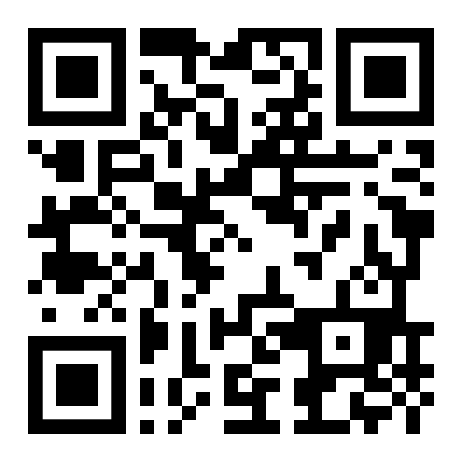
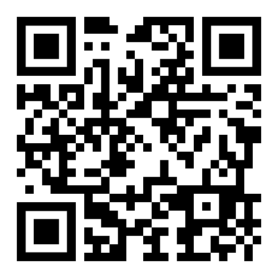
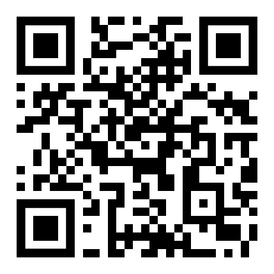

# Memory Triad

A set of working memory tasks in a triad of standalone lightweight web applications

----

### 1. Limited Hold

An implementation of the "masking task" and the "limited-hold memory task" using numerals,
arrows or letters as visual stimuli. Based on the numeric versions of the S. Inoue and
T. Matsuzawa 2007/2009 documentation

https://mtriad.github.io/1/

----

### 2. N-back

The dual n-back task using visual/aural stimuli. Based on the S. Jaeggi and M. Buschkuehl
2008 documentation

https://mtriad.github.io/2/

----

### 3. Backwards

An implementation of the classic memory span task in reverse. With dual visual/aural stimuli,
alternatively a single modality visual stimuli of colors

https://mtriad.github.io/3/

----
